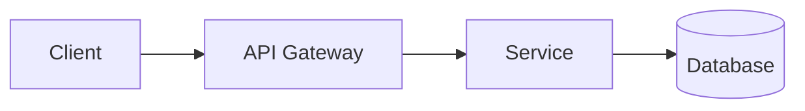

# Case Study Name

## Requirements

## Functional Requirements

## Non-Functional Requirements

## Scale Estimates

## API Design

## Data Model

## High-Level Architecture

## Components

## Data Flow

## Storage

## Caching

## Messaging

## Partitioning

## Replication

## Availability

## Consistency

## Failure Handling

## Bottlenecks

## Trade-offs

## Evolution / Scaling

## Interview Discussion

## Key Recall
