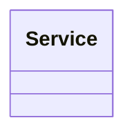
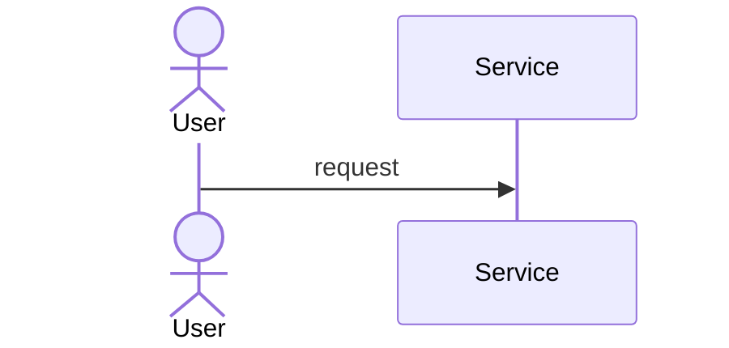

# LLD Problem Name

## Problem / Requirements

## Actors

## Use Cases

## Entities

## Relationships

## Interfaces

## Classes

## Responsibilities

## Design Patterns

## UML / Class Diagram

## Sequence Diagram

## Extensibility

## SOLID Considerations

## Trade-offs

## Java Implementation

## Key Recall
