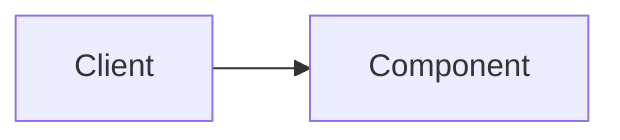

# Concept Name

## What Is It?

## Why Does It Exist?

## Problem It Solves

## Mental Model

## Architecture / Diagram

## Components

## Request / Data Flow

## Trade-offs

## Scaling Characteristics

## Failure Scenarios

## Alternatives

## When To Use

## When Not To Use

## Real-World Examples

## Interview Perspective

## Key Recall

## Related Concepts
