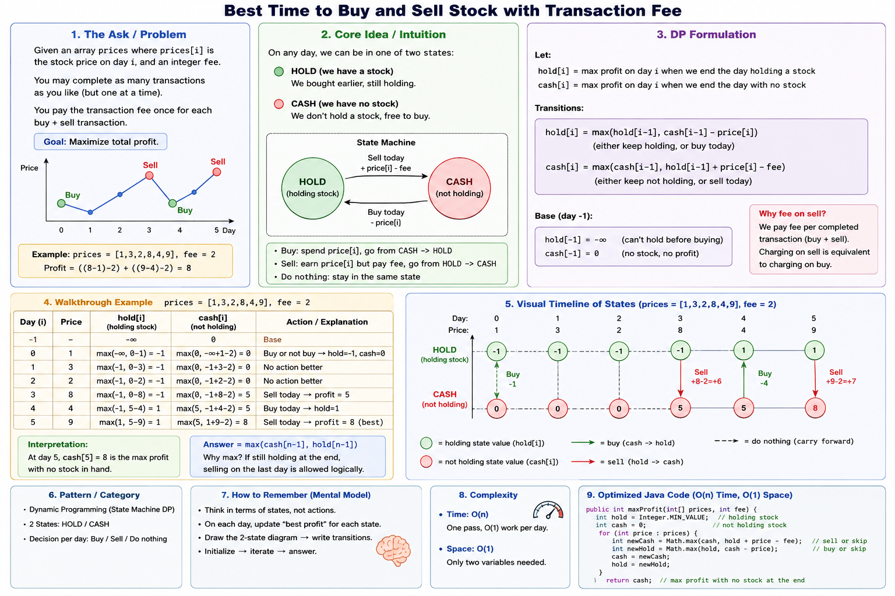
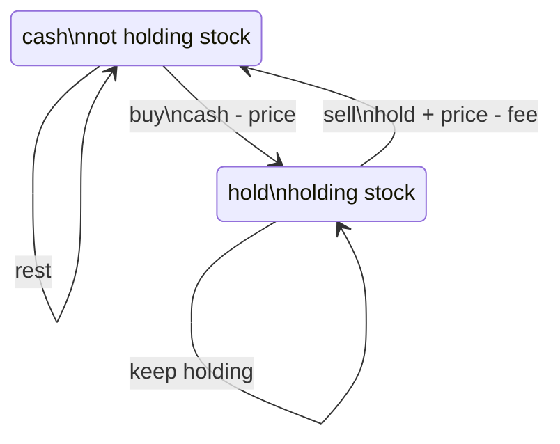

# Stock With Transaction Fee

## Quick Reference

- Source / problem link: LeetCode 714, Best Time to Buy and Sell Stock with Transaction Fee
- Difficulty: Medium
- Pattern: [Dynamic Programming](../index.md)
- Subpattern: [State Machine DP](index.md)
- Review status: Learning

## Problem in Short

Given daily stock prices and a fixed transaction fee, compute the maximum profit from any number of buy/sell transactions. You may hold at most one share at a time, and the fee is paid once per completed transaction.

Example:

```text
prices = [1, 3, 2, 8, 4, 9]
fee = 2
answer = 8
```

## What Is Being Asked?

Find the best sequence of buy, sell, and wait decisions that maximizes final profit after the last day, with no benefit from ending while still holding stock.

## Constraints -> Implications

Typical constraints allow many prices, so checking all transaction sequences is too expensive.

- If `n` is large, enumerating buy/sell pairs or all action sequences is not viable.
- Each day only needs the best result for two states: holding stock or not holding stock.
- This suggests an `O(n)` scan with `O(1)` state.

## Pattern Recognition

State Machine DP applies because after each day only two facts matter:

- Are we holding a stock?
- What is the best profit possible in that state?

The exact sequence of earlier buys and sells does not matter once we know the best `cash` and `hold` values.

Clues:

- Repeated buy/sell decisions
- Fee modifies transaction profit
- Cannot hold more than one stock
- Unlimited transactions, but actions are constrained by current state

## Base Pattern vs This Problem

The base stock state machine has:

- `cash`: best profit after day `i` while not holding stock
- `hold`: best profit after day `i` while holding stock

This problem changes the sell transition by subtracting the transaction fee:

```text
sell today = hold + price - fee
```

No new state is required because the fee does not create cooldown, transaction limits, or memory beyond the current sell action.

## Mental Model

Think of `cash` and `hold` as two scoreboards.

- `cash`: the best world where your hands are free after today
- `hold`: the best world where one stock is in your hand after today

Each price lets you either stay in the same world or move to the other world by buying or selling.

## Visual Model





## Recurrence

For each price:

```text
newCash = max(cash, hold + price - fee)
newHold = max(hold, cash - price)
cash = newCash
hold = newHold
```

Initialize:

```text
cash = 0
hold = -prices[0]
```

The answer is `cash`, because ending with stock still held means unrealized value.

## Algorithm

1. Set `cash = 0`.
2. Set `hold = -prices[0]`.
3. For each remaining price:
   - Either keep cash, or sell from hold and pay the fee.
   - Either keep holding, or buy from cash.
4. Return `cash`.

## Dry Run

For `prices = [1, 3, 2, 8, 4, 9]` and `fee = 2`:

| Day | Price | cash | hold | Explanation |
| --- | ---: | ---: | ---: | --- |
| 0 | 1 | 0 | -1 | Buy at 1 is possible. |
| 1 | 3 | 0 | -1 | Selling gives `-1 + 3 - 2 = 0`. |
| 2 | 2 | 0 | -1 | Buying at 2 gives `-2`, worse than `-1`. |
| 3 | 8 | 5 | -1 | Sell: `-1 + 8 - 2 = 5`. |
| 4 | 4 | 5 | 1 | Buy after profit: `5 - 4 = 1`. |
| 5 | 9 | 8 | 1 | Sell: `1 + 9 - 2 = 8`. |

Final answer: `8`.

## Java Implementation

```java
class Solution {
    public int maxProfit(int[] prices, int fee) {
        int cash = 0;
        int hold = -prices[0];

        for (int i = 1; i < prices.length; i++) {
            int price = prices[i];

            int nextCash = Math.max(cash, hold + price - fee);
            int nextHold = Math.max(hold, cash - price);

            cash = nextCash;
            hold = nextHold;
        }

        return cash;
    }
}
```

## Complexity

Time: `O(n)`

Each price is processed once, and each day performs a constant number of comparisons.

Space: `O(1)`

Only two running states, `cash` and `hold`, are stored regardless of input size.

## Common Mistakes

- Subtracting the fee on both buy and sell.
- Returning `hold` instead of `cash`.
- Creating a full DP array when only previous states are needed.
- Updating `cash` and then accidentally using the updated value for `hold` when the recurrence should use the previous day's values. Store `nextCash` and `nextHold` first.
- Treating this as a single-transaction problem.

## Key Recall

Two states are enough:

```text
cash = max(cash, hold + price - fee)
hold = max(hold, cash - price)
```

The fee modifies the sell transition. It does not require a new state.

## Related Problems

- Stock II -> baseline unlimited-transactions state machine without a fee.
- Stock With Fee -> modifies the `SELL` transition.
- Stock Cooldown -> adds a cooldown constraint after selling.
- Stock III -> adds transaction count for at most two transactions.
- Stock IV -> generalizes transaction count to `k`.
