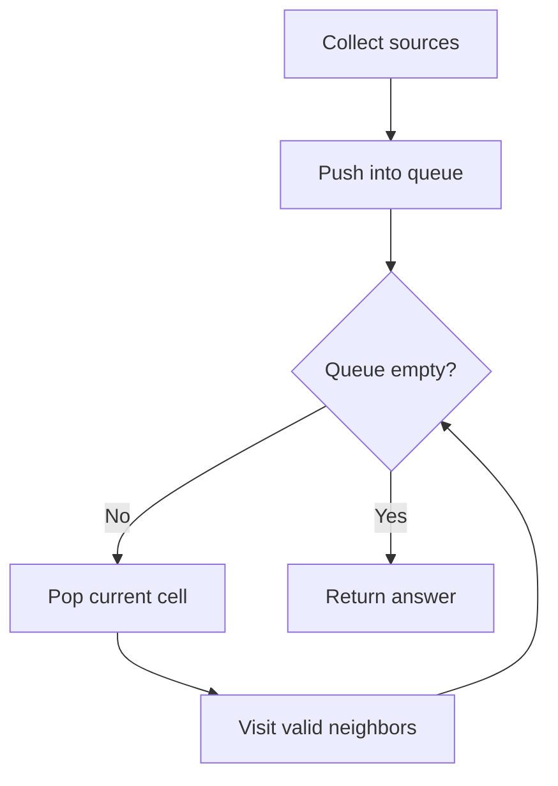

# Editable BFS Page Demo

This page is a local-only playground for testing page editing from the UI.

<div
  class="dynamic-page-editor"
  data-file="docs/problem-solving/patterns/graphs/bfs/editable-page-demo.md"
  data-section="bfs-editor-demo"
  markdown="1"
></div>

<script type="application/json" id="editable-blocks-bfs-editor-demo">
[
  {
    "id": "demo-question",
    "type": "question",
    "title": "Question",
    "body": "Given a grid, start BFS from <span style=\"color: #b45309;\">all source cells </span>and compute the <span style=\"background-color: #dcfce7;\">shortest</span> time/distance to reach every valid cell.\n\n1. First step\n2. Second step\n3. sdklgj\n4. First step\n5. Second step\n6. Third step\n\n1. Main step\n    a. Detail A\n    b. Detail B\n2. Next main stepMain step\n    a. Detail A\n    b. Detail B\n3. Next main step</span>\n    a. fqet",
    "boxBackground": "plain",
    "boxBorder": "none",
    "boxPadding": "normal",
    "boxWidth": "normal"
  },
  {
    "id": "demo-logic",
    "type": "logic",
    "title": "Logic",
    "body": "- Collect all starting cells first.\n- Push every source into the queue with distance 0.\n- Process BFS level by level.\n- Update unvisited neighbors with current distance + 1.\n- If a required cell is still unreachable at the end, return -1.",
    "boxBackground": "rose",
    "boxBorder": "full",
    "boxPadding": "compact",
    "boxWidth": "normal"
  },
  {
    "id": "demo-diagram",
    "type": "diagram",
    "title": "Flow Diagram",
    "body": "flowchart TD\n  A[Collect sources] --> B[Push into queue]\n  B --> C{Queue empty?}\n  C -- No --> D[Pop current cell]\n  D --> E[Visit valid neighbors]\n  E --> C\n  C -- Yes --> F[Return answer]",
    "boxBackground": "plain",
    "boxBorder": "none",
    "boxPadding": "normal",
    "boxWidth": "normal"
  },
  {
    "id": "demo-code-java",
    "type": "code",
    "title": "Java BFS Skeleton",
    "language": "java",
    "width": "narrow",
    "body": "Queue<int[]> q = new ArrayDeque<>();\nwhile (!q.isEmpty()) {\n    int[] current = q.poll();\n    int row = current[0];\n    int col = current[1];\n    int dist = current[2];\n\n    for (int[] dir : dirs) {\n        int nr = row + dir[0];\n        int nc = col + dir[1];\n        // validate, mark visited, push next state\n    }\n}",
    "boxBackground": "plain",
    "boxBorder": "none",
    "boxPadding": "normal",
    "boxWidth": "normal"
  },
  {
    "id": "demo-callout",
    "type": "callout",
    "kind": "tip",
    "title": "Recall",
    "body": "In multi-source BFS, all initial sources enter the queue before the first BFS step. That makes all sources distance 0.",
    "boxBackground": "plain",
    "boxBorder": "none",
    "boxPadding": "normal",
    "boxWidth": "normal"
  },
  {
    "id": "demo-checklist",
    "type": "checklist",
    "title": "Review Checklist",
    "body": "1. Main step\n    a. Detail A\n    b. Detail B\n2. Next main step\n    a. fsdhgk\n    b. gsdihgd\n\n\n1. Main step\n    a. Detail A\n    b. Detail B\n2. Next main stepMain step\n    a. Detail A\n    b. Detail B\n3. Next main step\n    a. fsdgh\n",
    "boxBackground": "plain",
    "boxBorder": "none",
    "boxPadding": "normal",
    "boxWidth": "normal"
  },
  {
    "id": "image-gallery-1786631919111",
    "type": "image",
    "title": "Image Gallery",
    "images": [],
    "src": "",
    "caption": "Add one or more screenshots here.",
    "imageSize": "medium",
    "align": "left",
    "layout": "sideBySide",
    "customWidth": "560px",
    "body": "",
    "boxBackground": "plain",
    "boxBorder": "none",
    "boxPadding": "normal",
    "boxWidth": "normal"
  }
]
</script>

<!-- rendered-blocks:bfs-editor-demo:start -->
<div class="admonition question" markdown="1">
<p class="admonition-title">Question</p>

<p>Given a grid, start BFS from <span style="color: #b45309;">all source cells </span>and compute the <span style="background-color: #dcfce7;">shortest</span> time/distance to reach every valid cell.</p>

<div class="learning-list">
  <div class="learning-list__line" style="--list-indent: 0;"><span class="learning-list__marker">1.</span><span>First step</span></div>
  <div class="learning-list__line" style="--list-indent: 0;"><span class="learning-list__marker">2.</span><span>Second step</span></div>
  <div class="learning-list__line" style="--list-indent: 0;"><span class="learning-list__marker">3.</span><span>sdklgj</span></div>
  <div class="learning-list__line" style="--list-indent: 0;"><span class="learning-list__marker">4.</span><span>First step</span></div>
  <div class="learning-list__line" style="--list-indent: 0;"><span class="learning-list__marker">5.</span><span>Second step</span></div>
  <div class="learning-list__line" style="--list-indent: 0;"><span class="learning-list__marker">6.</span><span>Third step</span></div>
</div>

<div class="learning-list">
  <div class="learning-list__line" style="--list-indent: 0;"><span class="learning-list__marker">1.</span><span>Main step</span></div>
  <div class="learning-list__line" style="--list-indent: 4;"><span class="learning-list__marker">a.</span><span>Detail A</span></div>
  <div class="learning-list__line" style="--list-indent: 4;"><span class="learning-list__marker">b.</span><span>Detail B</span></div>
  <div class="learning-list__line" style="--list-indent: 0;"><span class="learning-list__marker">2.</span><span>Next main stepMain step</span></div>
  <div class="learning-list__line" style="--list-indent: 4;"><span class="learning-list__marker">a.</span><span>Detail A</span></div>
  <div class="learning-list__line" style="--list-indent: 4;"><span class="learning-list__marker">b.</span><span>Detail B</span></div>
  <div class="learning-list__line" style="--list-indent: 0;"><span class="learning-list__marker">3.</span><span>Next main step&lt;/span&gt;</span></div>
  <div class="learning-list__line" style="--list-indent: 4;"><span class="learning-list__marker">a.</span><span>fqet</span></div>
</div>

</div>

<section class="content-box content-box--bg-rose content-box--border-full content-box--padding-compact content-box--width-normal" markdown="1">

## Logic

<div class="learning-list">
  <div class="learning-list__line" style="--list-indent: 0;"><span class="learning-list__marker">-</span><span>Collect all starting cells first.</span></div>
  <div class="learning-list__line" style="--list-indent: 0;"><span class="learning-list__marker">-</span><span>Push every source into the queue with distance 0.</span></div>
  <div class="learning-list__line" style="--list-indent: 0;"><span class="learning-list__marker">-</span><span>Process BFS level by level.</span></div>
  <div class="learning-list__line" style="--list-indent: 0;"><span class="learning-list__marker">-</span><span>Update unvisited neighbors with current distance + 1.</span></div>
  <div class="learning-list__line" style="--list-indent: 0;"><span class="learning-list__marker">-</span><span>If a required cell is still unreachable at the end, return -1.</span></div>
</div>

</section>

## Flow Diagram



<div class="code-window code-window--narrow" markdown="1">

```java title="Java BFS Skeleton"
Queue<int[]> q = new ArrayDeque<>();
while (!q.isEmpty()) {
    int[] current = q.poll();
    int row = current[0];
    int col = current[1];
    int dist = current[2];

    for (int[] dir : dirs) {
        int nr = row + dir[0];
        int nc = col + dir[1];
        // validate, mark visited, push next state
    }
}
```

</div>

<div class="admonition tip" markdown="1">
<p class="admonition-title">Recall</p>

<p>In multi-source BFS, all initial sources enter the queue before the first BFS step. That makes all sources distance 0.</p>

</div>

## Review Checklist

<div class="learning-list">
  <div class="learning-list__line" style="--list-indent: 0;"><span class="learning-list__marker">1.</span><span>Main step</span></div>
  <div class="learning-list__line" style="--list-indent: 4;"><span class="learning-list__marker">a.</span><span>Detail A</span></div>
  <div class="learning-list__line" style="--list-indent: 4;"><span class="learning-list__marker">b.</span><span>Detail B</span></div>
  <div class="learning-list__line" style="--list-indent: 0;"><span class="learning-list__marker">2.</span><span>Next main step</span></div>
  <div class="learning-list__line" style="--list-indent: 4;"><span class="learning-list__marker">a.</span><span>fsdhgk</span></div>
  <div class="learning-list__line" style="--list-indent: 4;"><span class="learning-list__marker">b.</span><span>gsdihgd</span></div>
</div>

<div class="learning-list">
  <div class="learning-list__line" style="--list-indent: 0;"><span class="learning-list__marker">1.</span><span>Main step</span></div>
  <div class="learning-list__line" style="--list-indent: 4;"><span class="learning-list__marker">a.</span><span>Detail A</span></div>
  <div class="learning-list__line" style="--list-indent: 4;"><span class="learning-list__marker">b.</span><span>Detail B</span></div>
  <div class="learning-list__line" style="--list-indent: 0;"><span class="learning-list__marker">2.</span><span>Next main stepMain step</span></div>
  <div class="learning-list__line" style="--list-indent: 4;"><span class="learning-list__marker">a.</span><span>Detail A</span></div>
  <div class="learning-list__line" style="--list-indent: 4;"><span class="learning-list__marker">b.</span><span>Detail B</span></div>
  <div class="learning-list__line" style="--list-indent: 0;"><span class="learning-list__marker">3.</span><span>Next main step</span></div>
  <div class="learning-list__line" style="--list-indent: 4;"><span class="learning-list__marker">a.</span><span>fsdgh</span></div>
</div>
<!-- rendered-blocks:bfs-editor-demo:end -->
