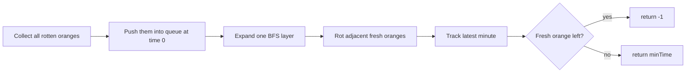

# Rotten Oranges

## Quick Reference

- Source / problem link: [LeetCode 994, Rotting Oranges](https://leetcode.com/problems/rotting-oranges/description/)
- Difficulty: Medium
- Pattern: [Graphs](../index.md)
- Subpattern: [BFS](index.md), Multi-source BFS on Grid
- Review status: Learning
- Imported from: `Latest Leetcode`, section `3.3 Rotten Oranges`

!!! warning "Import note"
    The source note says “first get all the gates” inside the Rotten Oranges section. That looks copied from a Walls and Gates style problem. I preserved the idea as “first collect all initially rotten oranges” below.

## Problem in Short

Given a grid where:

- `0` means empty cell
- `1` means fresh orange
- `2` means rotten orange

Every minute, rotten oranges make adjacent fresh oranges rotten in four directions. Return the minimum time needed to rot every fresh orange. If some fresh orange can never be reached, return `-1`.

## What Is Being Asked?

Compute the number of BFS levels required for all reachable fresh oranges to become rotten, starting from all initially rotten oranges at the same time.

## Pattern Recognition

This is a multi-source BFS problem.

The clues are:

- The grid behaves like an unweighted graph.
- Rot spreads one step per minute.
- All initially rotten oranges act as starting points.
- We need the minimum time, so layer-by-layer BFS is natural.

## Logic

!!! note "Source logic"
    The original note describes this as a Rotten Oranges pattern question. The key idea is to first collect all starting cells, put them in a queue with their distance/time, then process the queue level by level so all equally distant cells are handled together.

### Base Flow

- First collect all initially rotten oranges.
- Put them in the queue as `[i, j, dist]`.
- Keep removing from the queue.
- Process in chunks: all equally distant cells together.
- Update adjacent fresh cells with `+1` distance.
- Add newly rotten cells back to the queue.

### Approach 1

- Count rotten oranges.
- Count fresh oranges.
- Run BFS.
- Decrement fresh count whenever a fresh orange becomes rotten.
- Keep track of `newDist`.
- If `freshOnes == 0`, return `newDist`.
- If BFS ends and fresh oranges remain, return `-1`.

### Approach 2

- Track all rotten oranges.
- Run BFS.
- Keep track of time.
- Each time a new BFS layer is removed, keep/update the time.
- Add adjacent fresh oranges with `+1`.
- After BFS, scan the full matrix.
- If any fresh orange is left, it was not reachable from any rotten orange, so return `-1`.
- Otherwise return `minTime`.

## Mental Model

Think of all rotten oranges as fire sources. Each BFS layer is one minute. A fresh orange rots the first time the wave reaches it.

## Visual Model



## Algorithm

1. Scan the grid.
2. Add every initially rotten orange to the queue.
3. Run BFS from all sources together.
4. When an adjacent fresh orange is reached:
   - mark it rotten immediately
   - update the time
   - push it into the queue
5. After BFS, scan the grid again.
6. If any fresh orange remains, return `-1`.
7. Otherwise return the tracked time.

## Java Implementation

This version stores row, column, and time in the queue.

<div class="code-window" markdown="1">

```java title="Approach 2: Queue stores row, column, and time"
class Solution {
    int[][] dir = { { 0, 1 }, { 0, -1 }, { 1, 0 }, { -1, 0 } };
    int R;
    int C;
    int[][] arr;
    int minTime = 0;

    public int orangesRotting(int[][] arr) {
        this.arr = arr;
        this.R = arr.length;
        this.C = arr[0].length;

        ArrayDeque<int[]> q = new ArrayDeque<>();

        for (int i = 0; i < R; i++) {
            for (int j = 0; j < C; j++) {
                if (arr[i][j] == 2) {
                    q.add(new int[] { i, j, 0 });
                }
            }
        }

        bfs(q);

        for (int i = 0; i < R; i++) {
            for (int j = 0; j < C; j++) {
                if (arr[i][j] == 1) {
                    return -1;
                }
            }
        }

        return minTime;
    }

    public void bfs(ArrayDeque<int[]> q) {
        while (!q.isEmpty()) {
            int sz = q.size();

            for (int i = 0; i < sz; i++) {
                int[] rem = q.remove();

                for (int[] d : dir) {
                    int newI = rem[0] + d[0];
                    int newJ = rem[1] + d[1];
                    int newDist = rem[2] + 1;

                    if (isValid(newI, newJ) && arr[newI][newJ] == 1) {
                        arr[newI][newJ] = 2;
                        minTime = newDist;
                        q.add(new int[] { newI, newJ, newDist });
                    }
                }
            }
        }
    }

    boolean isValid(int x, int y) {
        return !(x < 0 || y < 0 || x >= R || y >= C);
    }
}
```

</div>

## Alternative Java Implementation

This version encodes each cell as `row * C + col`, so the queue stores only one integer per cell.

<div class="code-window" markdown="1">

```java title="Alternative: Queue stores encoded cell number"
class Solution {
    int[] dir = { 0, 1, 0, -1, 0 };
    int R;
    int C;
    int[][] arr;
    int minTime = 0;

    public int orangesRotting(int[][] arr) {
        this.arr = arr;
        this.R = arr.length;
        this.C = arr[0].length;

        ArrayDeque<Integer> q = new ArrayDeque<>();

        for (int i = 0; i < R; i++) {
            for (int j = 0; j < C; j++) {
                if (arr[i][j] == 2) {
                    q.add(i * C + j);
                }
            }
        }

        while (!q.isEmpty()) {
            int sz = q.size();
            int outerTime = minTime;

            for (int i1 = 0; i1 < sz; i1++) {
                int rem = q.remove();
                int i = rem / C;
                int j = rem % C;

                for (int k = 0; k < 4; k++) {
                    int newI = i + dir[k];
                    int newJ = j + dir[k + 1];

                    if (!(newI < 0 || newJ < 0 || newI >= R || newJ >= C)
                            && arr[newI][newJ] == 1) {
                        arr[newI][newJ] = 2;
                        minTime = outerTime + 1;
                        q.add(newI * C + newJ);
                    }
                }
            }
        }

        for (int i = 0; i < R; i++) {
            for (int j = 0; j < C; j++) {
                if (arr[i][j] == 1) {
                    return -1;
                }
            }
        }

        return minTime;
    }
}
```

</div>

## Complexity

Time: `O(R * C)`

Each cell is scanned at most twice: once to collect rotten oranges and once to check if fresh oranges remain. During BFS, each cell can enter the queue at most once.

Space: `O(R * C)`

In the worst case, the queue can hold many grid cells.

## Common Mistakes

- Starting BFS from only one rotten orange instead of all rotten oranges.
- Marking a fresh orange rotten only after removing it from the queue. Mark it when adding to avoid duplicate queue entries.
- Forgetting the final scan for unreachable fresh oranges.
- Treating diagonal cells as adjacent.
- Confusing this with Walls and Gates; here the sources are initially rotten oranges, not gates.

## Key Recall

Multi-source BFS:

```text
all rotten oranges enter queue first
each BFS layer = one minute
mark fresh as rotten when enqueued
fresh left after BFS => -1
```

## Local Edit Demo

This section is a local-only proof that a page can expose editable fields and save them back into the Markdown file.

<div
  class="local-page-editor"
  data-file="docs/problem-solving/patterns/graphs/bfs/rotten-oranges.md"
  data-section="rotten-oranges-local-notes"
  data-label="Scratch notes"
  markdown="1"
></div>

<!-- editable:rotten-oranges-local-notes:start -->
Demo saved from the local UI.

hi 

This proves the page can write back to Markdown locally.
<!-- editable:rotten-oranges-local-notes:end -->

## Related Problems

- Walls and Gates -> same multi-source BFS shape, different source cells.
- 01 Matrix -> BFS from all zero cells to nearest zero distance.
- Shortest Path in Binary Matrix -> grid BFS with different movement rules.
